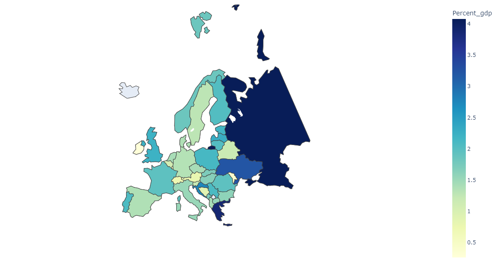
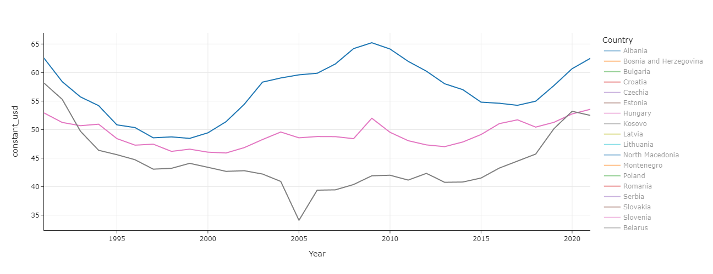

# European military spending
This web application explores a subset of SIPRI's military expenditure dataset.

**Table of contents**
1. [Introduction](#introduction)
2. [Using the web application](#how-to-use)
3. [Analysis](#analysis)

## 1. Introduction

### 1.1. Interest
The annexion of Crimea by Russia in 2014 and, more recently, Russia's invasion of the Ukrainian territory on February 24th 2022 has brought back war to the European continent for the first time since the mid-90s.

The purpose of this web application is to assess the amount of resources allocated to military spending in Europe after 1991. It aims at answering questions like:
- Which countries are the main military powers in Europe?
- How has military spending evolved since the end of the Cold War, and how have certain events like September 11th 2001 or the economic crisis of 2008 impacted military spending?
- Which countries comply with NATO's spending guidelines?
- How large is the military spending gap between Russia and Ukraine or other European military powers?

### 1.2. Data sources
The web application uses military expenditure data from the Stockholm International Peace Research Institute (SIPRI). In addition to military expenditure, SIPRI provides datasets on arms transfers, industry and peace operations. All datasets can be accessed [at this link](https://www.sipri.org/databases).

SIPRI's [military expenditure database](https://www.sipri.org/databases/milex) is updated annually and covers military spending in the world since 1949 (provided data was available for your country of interest). The data set is built on sources like official documents (e.g. national budget and defense white papers), international statistics (e.g. from NATO or IMF), and specialist journals. SIPRI's methodology is detailed [at this link](https://www.sipri.org/databases/milex/sources-and-methods).

## 2. Using the web application

### 2.1. Running the application
The application was built with Dash in Python. At this stage it is not deployed to a server and must be run locally. To download the app, clone this repository and run app.py.

### 2.2. Navigation
Users can choose a variable in the dropdown menu at the top of the map. All visualizations will be updated with the chosen measurement:
- Percentage of GDP: expenditure expressed as a percentage of the country's gross domestic product.
- US dollars: expenditure expressed in Billions of constant 2020 dollars.
- US dollars per capita: expenditure expressed in current dollars per country inhabitants.

The application features two types of visualization:
- A choropleth map of europe coloring countries based on the selected measurement. Years represented on the choropleth can be changed with the slider on the left-hand side.
- A time series chart visualizing variables from 1991 to 2021. By default all countries are represented on the graph, but users can narrow down the selection to one or several countries by clicking on the legent on the right-hand side. Clicking on a country on the map will also narrow down the time series to this selection.

## 3. Analysis
This section features some insights obtained from visualizing SIPRI's data.

### 3.1. European military powers

**a. In constant dollars**

Looking at constant dollars spending for the year 2021, the four main European military powers are:
1. Russia - $63Bn
2. United Kingdom - $62Bn
3. France - $54Bn
4. Germany - $52Bn

Together these 4 countries spend more on military than the rest of Europe combined (~60% of European military spending). Germany, the United Kingdom and France are the largest economies of the continent so it is no suprise to find them among this list. However, the presence of Russia at #1 despite a GDP 61% lower than the Germany's highlight that not all countries allocate the same efforts to their military.

Looking this time into the proportion of GDP in 2021:
* Russia - 4.1% of 2021 GDP
* United Kingdom - 2.2%
* France - 1.95%
* Germany - 1.34%

**b. In proportion of GDP**

Many smaller economies allocate a larger share of their GDP to military expenditure than Germany, the UK or France. In fact, the top 4 spenders are:
1. Russia - 4.1%
2. Greece - 3.8%
3. Ukraine - 3.2%
4. Croatia - 2.8%

**c. Per capita**
The last view available in the application is military expenditure expressed as USD per inhabitant. The ranking of top military spenders significantly changes again for the year 2021:
1. Norway - $1,509 per capita
2. Finland - $1,064
3. United Kingdom - $1,002
4. Denmark - $927

### 3.2. Evolution of spending since the end of the Cold War

**a. From 1991 to 2001**

The end of the Cold War in 1991 and peace dividends have justified a reduction of military spending in most of Europe.

In the United Kingdom for example, military spending fell by 21% between 1991 and 2000 (from $63Bn to $49Bn) lowering its share of GDP allocated to military from 4.1% to 2.4%. Similarly, France decreased its spending by 13% over the same period, lowering its share of GDP from 2.8% to 2.1%.

While not all countries reduced their military expenditure in the same proportion following the end of the Cold War (Italy increased it by 13%), most European countries followed the same trend.

**b. From 9/11 to the 2008 economic crisis**

**c. After 2008**

### 3.3. Ukrainian conflict

**a. Russia vs Ukraine**

**b. Baltic states**

**c. NATO**

