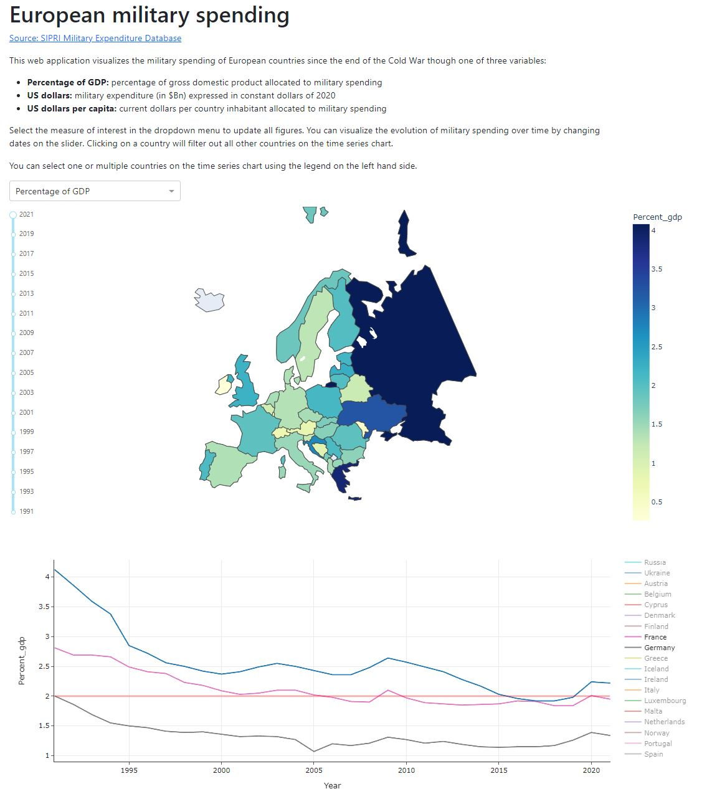

# European military spending

## 1. Introduction

### 1.1 Interest
The annexion of Crimea by Russia in 2014 and more recently Russia's invasion of the Ukrainian territory has brought back war to the European continent for the first time since the mid-90s.

The purpose of this web application is to assess the amount of resources allocated to military spending in Europe. It aims at answering questions like:
- Which countries are the main military powers in Europe?
- How has military spending evolved since the end of the Cold War, and how have certain events like the terrorist attacks of September 11th 2001 or the economic crisis of 2008 impacted military spending?
- Which countries comply with NATO's spending guidelines?
- How large is the military spending gap between Russia and Ukraine or other European military powers?

### 1.2 Data sources
The web application uses military expenditure data from the Stockholm International Peace Research Institute (SIPRI). In addition to military expenditure, SIPRI provides datasets on arms transfers, industry and peace operations. All datasets can be accessed [at this link](https://www.sipri.org/databases).

SIPRI's [military expenditure database](https://www.sipri.org/databases/milex) is updated annually and covers military spending in the world since 1949 (provided data was available for your country of interest). The data set is built on sources like official documents (e.g. national budget and defense white papers), international statistics (e.g. from NATO or IMF), and specialist journals. SIPRI's methodology is detailed [at this link](https://www.sipri.org/databases/milex/sources-and-methods).

## 2. Using the web application

### 2.1 Running the application
The application was built with Dash in Python. At this stage it is not deployed to a server and must be launched locally. To download the app, clone this repository and run app.py.

### 2.2 Navigation
Users can choose a variable in the dropdown menu at the top of the map. All visualizations will be updated with the chosen measurement:
- Percentage of GDP: expenditure expressed as a percentage of the country's gross domestic product.
- US dollars: expenditure expressed in Billions of constant 2020 dollars.
- US dollars per capita: expenditure expressed in current dollars per country inhabitants.

The application features two types of visualization:
- A choropleth map of europe coloring countries based on the selected measurement. Years represented on the choropleth can be changed with the slider on the left-hand side.
- A time series chart visualizing variables from 1991 to 2021. By default all countries are represented on the graph, but users can narrow down the selection to one or several countries by clicking on the legent on the right-hand side. Clicking on a country on the map will also narrow down the time series to this selection.

## 3. Analysis
* Coming soon *

This section features some insights obtained from visualizing SIPRI's data.

### 3.1 From the end of the Cold War to 9/11

### 3.2 Impact of the 2008 Financial Crisis

### 3.2 Russian military spending
